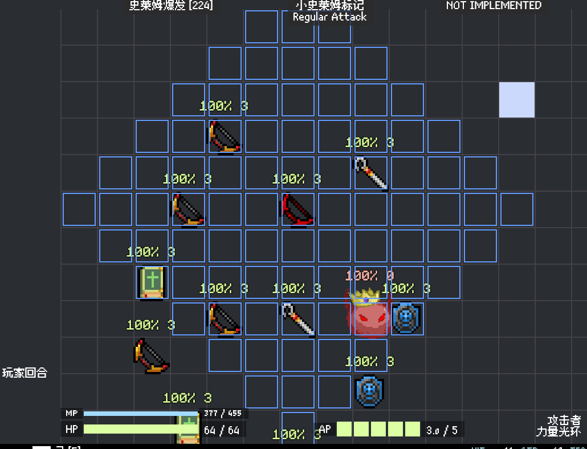
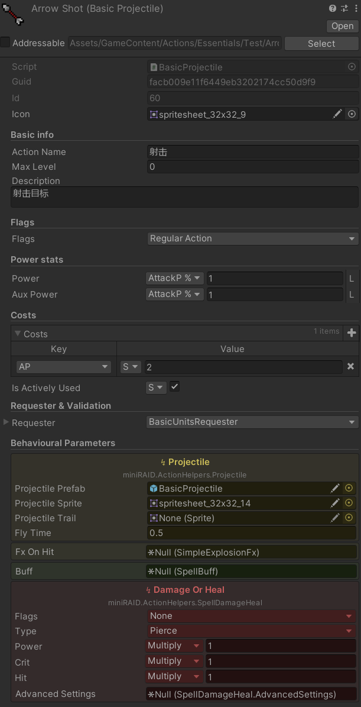
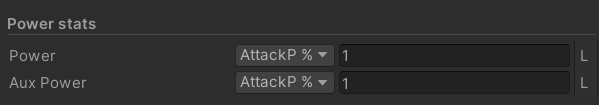
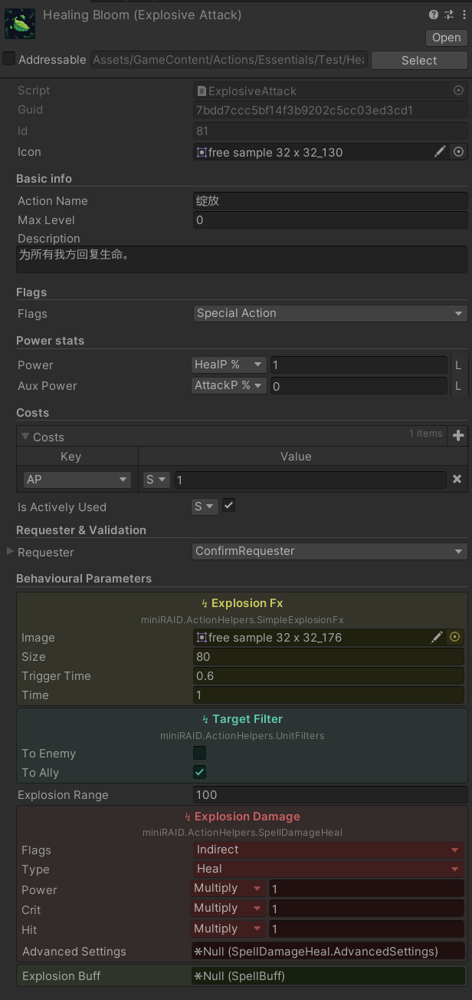
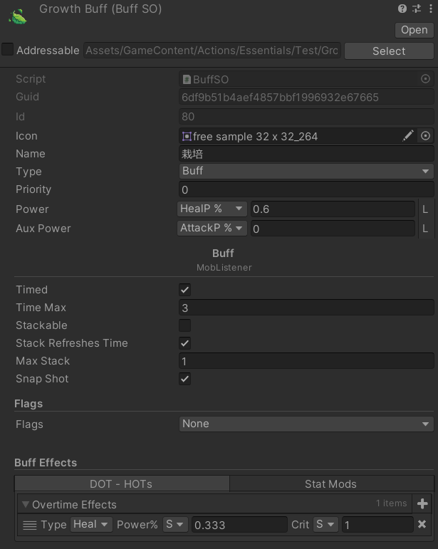
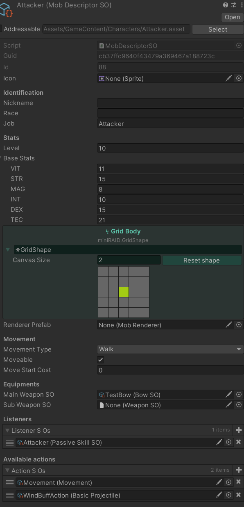

# Manual

Manual ver 0.0

[TOC]

~~中文文档好难写~~

## 概述

miniRAID的战斗场景（`Scenes/NewScene`）大体由以下几部分组成：

- 预先放置好的玩家与敌人。之后这部分将被玩家 / 敌人的生成器代替，来通过代码或其它手段定义战斗中出现的单位。
- 摄像机组（使用`Cinemachine2D`的虚拟摄像机）
- 格子和格子管理器（`GridOverlayManager`）。格子管理器可以接收一组坐标点，显示各种颜色的提示（如下图）



- UI组件。miniRAID现在同时使用了UGUI和UI Toolkit。
- 战斗管理器`CombatManager`
- 用来播BGM的模块

场景之外，在后台计算的逻辑统称为后端（Backend），前端（UI和MobRenderer组件）会获取对应的后端状态进行渲染。后端的主要组成部分：

- `MobData` - 代表一个单位，通常对应一个场景中具有`MobRenderer`组件（Component）的GameObject。
- `MobListener` - 代表施加在单位身上的各种效果，包括Buff、装备、主动和被动技能等。这些listener可以监听MobData的各种事件来实现自己的效果。
- `CombatSchedulerCoroutine` - 以[协程](https://docs.unity3d.com/cn/2022.2/Manual/Coroutines.html)的方式串联起整个战斗流程，如回合的开始和结束等。

- `DataBackend`- 用以存储地图信息，如地图中所有的`MobData`
  - `Databackend.cs`中还有包含一系列配置参数（如基础命中率，属性种类等）的`Consts`静态类
- `Globals`静态类存储了绝大多数单例的引用，可在有需要时使用。

## 快速上手

### 编写一个新技能逻辑

首先在`Project`窗口中右键并选择 `Create > Script Templates > New Action Data SO`。

以下是一个示例：

```c#
public class BasicProjectile : ActionDataSO
{
    public ActionHelpers.Projectile projectile;
    public SpellDamageHeal damageOrHeal;

    public override IEnumerator OnPerform(RuntimeAction ract, MobData mob, SpellTarget targets)
    {
        Vector3Int target = targets.targetPos[0];
        MobData dst = Globals.backend.GetMap(target.x, target.y, target.z)?.mob;
        
        if(dst == null) { yield break; }

        if(projectile != null)
            yield return new JumpIn(projectile.WaitForShootAt(mob, target));

        if(damageOrHeal != null)
            yield return new JumpIn(damageOrHeal.Do(ract, mob, dst));
    }
}
```

一个技能逻辑应该继承`ActionDataSO`并重载其`OnPerform`函数，来实现自定义的技能释放效果。

`ActionDataSO`对应存储了技能的基本数据和参数的文件。当单位获得新技能时，会将这些数据实例化为一个`RuntimeAction`，对应`OnPerform`的第一个参数。

剩下的两个参数分别是释放这个技能的单位与技能的目标（一个`Vector3Int`数组）。

`OnPerform`是一个[协程](https://docs.unity3d.com/cn/2022.2/Manual/Coroutines.html)，它可以近乎异步地等待动画完成等。这对编写具有演出效果的技能逻辑很有帮助。

我们首先获取位于第一个目标格中的单位：

```c#
Vector3Int target = targets.targetPos[0];
MobData dst = Globals.backend.GetMap(target.x, target.y, target.z)?.mob;
// 与 MobData dst = Essentials.MobAtGrid(target); 等价

// 如果目标格没有单位，结束技能释放
if(dst == null) { yield break; }
```

这里使用了`DataBackend`的单例`Globals.backend`获取地图格的信息。

之后，使用帮助类`ActionHelpers.Projectile projectile`来播放一段投射物的动画。

```c#
if(projectile != null)
    yield return new JumpIn(projectile.WaitForShootAt(mob, target));
```

`yield return new JumpIn(...)` 等同于在当前位置建立一个新的协程并等待其结束。与Unity协程不同的地方是，如果新协程立刻结束，程序将立刻往下运行而不会等待1帧。

让我们看一下`WaitForShootAt`内部的逻辑：

```c#
public IEnumerator WaitForShootAt(
    MobData mob, 
    Vector3Int target)
{
    // 检查mob是否有效且动画没有被跳过
    // Globals.cc中存储了这段协程使用到的上下文信息（CoroutineContext），
    // 目前包含是否播放动画的设置与随机数发生器。
    if (Globals.cc.animation && mob.mobRenderer != null)
    {
        // 在释放技能的mob处创建一个投射物GameObject
        GameObject obj = GameObject.Instantiate(projectilePrefab, mob.mobRenderer.transform.position + Vector3.back, Quaternion.identity);

        // 设置投射物参数（图像）
        obj.GetComponent<TestProjectile>().Init(projectileSprite, projectileTrail, Color.white, Color.white);

        // 计算目标点位置
        Vector3 dest = Globals.backend.GridToWorldPos(target) + new Vector3(.5f, .5f, .5f);
        dest.z = obj.transform.position.z;

        // 利用DOTween播放一段投射物飞向目标点的动画
        // 并等待动画完成
        yield return obj.transform
            .DOMove(dest, flyTime)
            .SetEase(Ease.Linear)
            .WaitForCompletion(true);
        
        // 停止投射物的动画效果（粒子效果）
        obj.GetComponent<TestProjectile>().Stop();

        // 在指定的时间后销毁投射物
        GameObject.Destroy(obj, Settings.fxTimeout);
    }
}
```

在这段协程执行完后，投射物动画即播放完毕，程序将继续执行`OnPerform`中的内容：

```c#
if(damageOrHeal != null)
    yield return new JumpIn(damageOrHeal.Do(ract, mob, dst));
```

这将对目标造成伤害，伤害的数值等被存储在`SpellDamageHeal damageOrHeal`中。

造成伤害的过程同样是一段协程，这是因为伤害计算需要等待目标身上可能存在的效果触发完毕（如史莱姆爆发），这其中可能包含需要等待的动画。

逻辑编写完成后，可以新建一个asset文件来保存技能信息；或者也可以使用已经存在的技能逻辑。

在`Project`窗口右击选择`Create Action`，并在弹出的窗口中选择对应的技能逻辑。

选中新创建好的asset文件，可以在Inspector中看到类似以下的信息：



- Max Level - 最高技能等级。目前不用管
- Flags - 技能的各种flags，如直接伤害、不可被打断等等
- Power / Aux Power - 技能的威力。上图中，技能的威力是100%攻击强度（AttackPower）。
- Costs - 技能的消耗（2AP）。"S"代表消耗为静态（大多数情况下都应如此）。
  - "D"允许将消耗改为一个输入为MobData, SpellTarget的Lua函数。
- Requester & Validation - 指定选取技能后UI的提示模式（如何选取目标）。点击左侧的三角可以配置详细参数，如射程等。
  - BasicUnitsRequester - 选取1个在射程范围内的指定阵营目标。
  - ConfirmRequester - 选取自己为目标。
- Behavioural Parameters - 之前在逻辑中声明的`Projectile`, `SpellDamageHeal`帮助类的参数。
  - Projectile - 可以指定投射物所使用的图像（现在只是测试用…）
  - DamageHeal
    - 本次伤害的flags
    - 属性
    - 伤害值（之前计算过的技能威力的百分比）
    - 暴击Crit、命中Hit（单位命中 / 暴击属性的百分比）


至此，这个技能已经可以使用了。找到一个MobDescriptor（如`GameContent/Characters/Attacker`），把刚刚创建的技能文件拖入`Available Actions (Action S Os)`便可以在对应单位上找到这个技能。

或者也可以将技能放置到武器上。


### 编写一个增益 / 减益效果

`Projects (Assets) > Create Buff`

#### 基本效果 (miniRAID.Buff.BuffSO)

DOT / HOT

修改单位属性

#### 自定义效果

同`ActionDataSO`，在`Script Template`中选择`BuffSO`

如`WindBuffNew`（狂风加护）：

```c#
public class WindBuffSO : BuffSO
{
    public override MobListener Wrap(MobData parent)
    {
        return new WindBuff(parent, this);
    }
}

public class WindBuff : Buff
{
    public WindBuff(MobData source, BuffSO data) : base(source, data)
    {}

    public override void OnAttach(MobData mob)
    {
        base.OnAttach(mob);

        mob.OnCostQuery += MobOnCostQuery;
        onRemoveFromMob += m =>
        {
            m.OnCostQuery -= MobOnCostQuery;
        };
    }

    private void MobOnCostQuery(Cost cost, RuntimeAction ract, MobData mob)
    {
        if (cost.type == Cost.Type.AP)
        {
            if (cost.value > 1)
            {
                cost.Substract((dNumber)1);
            }
        }
    }
}
```

目前必须要编写`BuffSO`和`Buff`两部分，即使`BuffSO`唯一的作用就是与对应的运行时`Buff`连起来。

`WindBuff`监听了`MobData`的`OnCostQuery`事件。在Mob查询技能消耗时，`WindBuff`修改技能的AP消耗从而实现其效果。

随后流程同上。

## MobData的事件

各种事件见`Scripts/Backend/MobData/MobData.events.cs`。

### 属性计算

后端会在各种时刻调用`MobData.RecalculateStats`进行属性的重新计算。流程如下：

```c#
public void RecalculateStats()
{
    baseDescriptor.RecalculateMobBaseStats(this);

    OnBaseStatCalculation?.Invoke(this);

    float healthPercent = (float)health / maxHealth;

    baseDescriptor.RecalculateMobBattleStats(this);

    OnStatCalculation?.Invoke(this);

    // Set current health based on previous percentage
    health = Mathf.Clamp(Mathf.CeilToInt(maxHealth * healthPercent), 0, maxHealth);

    RefreshActions();
    OnActionStatCalculation?.Invoke(this);

    OnStatCalculationFinish?.Invoke(this);
}
```


- 最基础的属性保存在`MobDescriptorSO`中。`MobData`首先使用所选的`MobDescriptorSO`来更新自己的基础属性（主要是六围）；这一过程可以被重载。
- 随后触发`OnBaseStatCalculation`事件，等待MobListener对自己的基础属性做出修正。
- 然后计算战斗属性。
- 最后刷新当前可用的技能列表。可用技能的变动基本都发生于此，如弓的瞄准和神秘道具的特殊攻击。

## 技能与物品等级

技能（包括Buff等）可以拥有等级，但目前没有实现。

使用`LeveledStats<T>`包住所使用的属性，便可以对不同等级的属性进行修改。在Inspector中点击右侧的L（Leveled）：



对应属性就会按等级分开便于调整。

物品等级的实现目前是另一套，之后会合起来。物品的所需属性由需求等级计算而来，而物品提供的属性由物品等级计算。可以为需求和提供的属性设置一个标准值，详见Inspector中的说明（如`GameContent/Weapons/Test`中的武器）。

物品的所需等级 / 属性目前没有实际作用。

### 本地化

还没想好本地化怎么做

## ScriptableObject (SO)

miniRAID广泛使用了 [ScriptableObject](https://docs.unity3d.com/cn/2022.2/Manual/class-ScriptableObject.html) 来储存各种配置信息，主要在`GameContent/`目录下。

比如：

- 技能信息（威力、效果参数等）



- 增益效果（Buff）；下图展示了一个持续3回合的HOT效果（栽培），每跳造成 60% * 33.3% = 20% 治疗强度的治疗。



- 单位信息，如下图展示的Attacker和他拥有的WindBuffAction（狂风加护）等技能；这个技能也是一个ScriptableObject。



### MobListenerSO和ActionDataSO的运行时

在运行时，存储技能（Action）和MobListener的SO都会通过各自的 `Wrap` 方法创建一个`MobListener`实例。这是因为储存原始数据的SO只有一份，如果多个Mob拥有同样的Listener（如技能“移动”、被动技能“攻击者”等），则无法修改各自Listener中的内容（甚至对SO的改动还会被永久保存）。

`Wrap`相当于一个“复制”过程，但尽管概念相近，`MobListenerSO`和`MobListener`并不是同一个东西。`SO`储存的是类似配置一类的数据，而`Wrap`出来的实例才会真正提供给各单位`MobData`。

## 编辑器 (UnityEditor)

在菜单栏中的`miniRAID`标签下有一些对调整数据有帮助的面板：

- Mob Monitor，可以监视对应Mob的仇恨值情况。
- Combat Monitor，可以监视团队每回合造成 / 受到的伤害和治疗量，也可以看到随机数发生器的历史记录。

剩下的还不怎么能用。